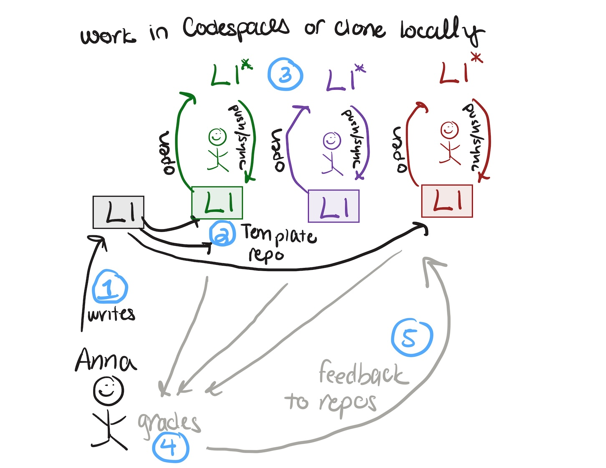
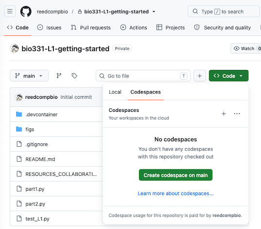
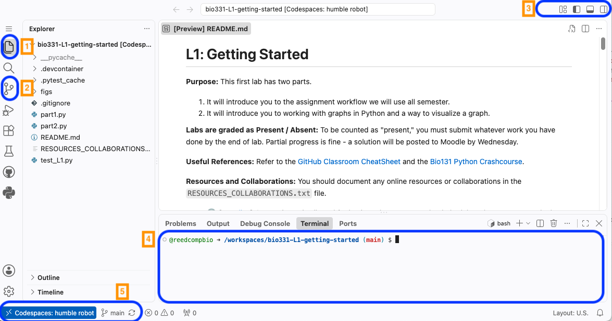
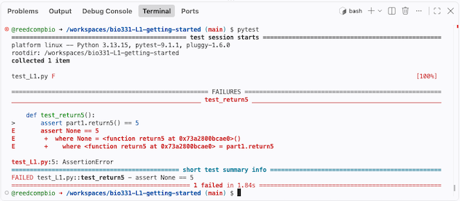
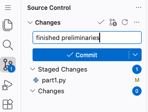
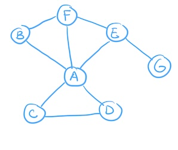

# L1: Getting Started

**Purpose:** This first lab has two parts. 
1. It will introduce you to the assignment workflow we will use all semester.
2. It will introduce you to working with graphs in Python and a way to visualize a graph. 

**Labs are graded as Present / Absent:** To be counted as "present," you must submit whatever work you have done by the end of lab. Partial progress is fine - a solution will be posted to Moodle by Wednesday.

**Useful References:** Refer to the [GitHub Classroom CheatSheet](https://reed-compbio-classes.github.io/github-classroom-cheatsheet/) and the [Bio131 Python Crashcourse](https://reed-compbio-classes.github.io/python-crashcourse/).

**Resources and Collaborations:** You should document any online resources or collaborations in the `RESOURCES_COLLABORATIONS.txt` file. 
- :alien: [[AI policy](https://reed-compbio-classes.github.io/bio331-syllabus/doc/policies/#online-resources--generative-ai-policy)] Generative AI is allowed for basic Python syntax and to help debug, but you may not look up the code for entire functions that are part of an assignment or lab. 
- :handshake: [[Collaboration policy](https://reed-compbio-classes.github.io/bio331-syllabus/doc/policies/#collaboration-policy)] You are welcome to work with anyone on the labs, though you must write all of your own code. 

:white_check_mark: [AI Disclaimer] Claude was used to update instructions for GitHub Codespace usage and to improve clarity. 

## Before You Begin

Before you start this (or any) lab or assignment, get your own copy of the repo and give me access to it:

1. On this repo's GitHub page, click the green **Use this template** button (near the top, next to "Code") and choose **Create a new repository**.
2. Set the **Owner** to your own GitHub account and set **Visibility** to **Private**. Keep the repository name the same as the template name (in this case, `bio331-L1-getting-started`). Click **Create repository**.
3. In your new repo (your username should be in the URL), go to **Settings -> Collaborators and teams -> Add people**, and invite `annaritz`. This is how I get access to see and give feedback on your work - without this step I can't see it.

This lab will explain how to open your new repo in a Codespace, work in that Codespace, and get your changes back to your new repo.

:bulb: Bookmark/star your own GitHub repositories page to find all your Bio331 repos in one place: go to your GitHub profile and click the **Repositories** tab (or go directly to `github.com/<your-username>?tab=repositories`). Your repos are private - that means that only you and I (once you've added me as a collaborator) can view them.

:question: If you don't see the "Use this template" button, or your invite to `annaritz` doesn't seem to work, let me know right away - I likely need to double check your access to the template repo.

## 1. Working in GitHub

If you're reading this, you already have a GitHub account and you've made your own copy of this repo using the steps in **Before You Begin** above. Welcome! 

**What is GitHub?** GitHub is a cloud-based system that stores and manages projects. It is especially useful for managing programming-based projects. All of the labs and programming assignments will be available on GitHub as template repositories that you copy into your own account. It is the place where you submit your work by committing and syncing it to your project.

When you used the template to create your own copy, a copy of the lab was made in _your_ GitHub account so it will record your modifications. This copy is called a _repository_ (or repo for short), and each student will have their own repo for the lab, copied from the template repo I set up in our GitHub organization. 



The workflow for Bio331 assignments looks like this:
1. I write an assignment (here, L1) and make it a private template repo in our GitHub organization.
2. You use the template to create your own private copy in your own account, and add me as a collaborator. 
3. When you are ready to work on the assignment, you open it in Codespaces (see below) and do your work there. When you are ready to submit, you must _commit_ and _push/sync_ your work to your repo. 
4. When the assignment is due, I will grade the work in your repo (assignments only).
5. I will communicate feedback through a Pull Request in your repo (assignments only).

### 1A. Open your repo in a GitHub Codespace

**What are GitHub Codespaces?**  Codespace is a cloud-based environment (provided by GitHub) that allows you to run Python code in your web browser - no downloads and installation needed. Open a Codespace directly from the repo:



A new window will open after a few seconds, and your URL will be unique to you. Codespace runs in an editor called VSCode (which can also be used locally for those cloning repos). 



The screenshot above highlights some useful features of VSCode:
1. File Explorer in the left-hand pane (where you can view all files).
2. Source Control navigator in the left-hand pane (where you can commit assignments).
3. Layout options in the upper right bar (where you can hide/view the Explorer and the Terminal).
4. The Terminal in the bottom pane (where you will type some commands).
5. The bottom right bar includes information about the programming environment and the GitHub repo.

:bulb: When you open a Codespace, it opens with all the Python packages you need already installed - you shouldn't have to install anything yourself. If you're working locally, reopen your editor using the `.devcontainer/devcontainer.json` dev container (VSCode will prompt you to do this automatically) to use the same Docker image (annaritz/class-dev:bio331). Let me know if you'd rather insatll packages into your own Python environment instead (e.g., with a `requirements.txt` file).
 
:exclamation: Your Codespace is _not_ permanent; in a few months it may disappear. You must _commit_ your changes and _sync_ them to your GitHub repository.

## 1B. Run, test, and fix `part1.py`

Open `part1.py` and read its contents. It imports a few modules and has two functions. Run the file by clicking the play button in the upper-right hand corner. You should see:

```
In the main function
return5() -->  None
```

I have written a Python test in `test_L1.py`. Type `pytest` in the VSCode terminal and you should see one failing test:



This test fails because the `return5()` function should return the number `5`, but it returns `None`. Make sure you understand how Python tests communicate this information.

Finally, modify the function to return the integer `5`. Run `part1.py` again to confirm that a `5` is now printed to the screen. The test should now pass (confirm by running `pytest` in the terminal).

### 1C. Submit the change

Submitting your assignment requires pushing your changes from your Codespace to your GitHub repo. 

1. Click on the source control navigator (#2 on the VSCode screenshot).
2. _Stage_ the modified file for commit by clicking the "+" sign next to `part1.py`. 
3. Write a short, informative message that tells you what the change is about. 
4. _Commit_ this change by clicking the Commit button (screenshot below).
5. _Push/Sync_ your commit to your GitHub repo. 



**Important:** Commit and sync frequently (for example, every time you make progress). This saves intermediate versions of your work.

### 1D. Check that your work is committed

You'll know your changes are committed once your commit message appears in your repository on GitHub. You can check this by going to your repository page and confirming that your commit message appears in the list of files. 

## 2. Introduction to Graphs

In part 2, you will learn how to represent graphs in Python and interactively visualize graphs within a web browser. You will also calculate your first graph statistic: the _node degree_. We will use the following graph in our example:



This graph can be described by a list of edges (called an _edge list_). Open `part2.py`, inspect its contents, and run it. The `main()` function contains a variable `graph` that is a list of two-element lists - this is the edge list for the graph above. 

### 2A: Practice some Python

The `main()` function already prints the entire `graph` variable. Write additional code in the `main()` function to:

1. Print each edge on its own line.
2. Count and print the number of edges.
3. Make a list of nodes and assign it to the variable `nodes`.
4. Count and print the number of nodes.

### 2B: Visualize the graph

There is a `viz_graph()` function in `part2.py`. Before moving to that function, make sure you _call_ the function from within `main()`. In other words, somewhere in your `main()` function you should have the line:

```
viz_graph(graph,nodes,'graph.html')
```

where the string `graph.html` is the name of the output file the `viz_graph()` function will write to. You can name the output file anything that ends in `.html`. 

Write all of the remaining code in the `viz_graph()` function. We will use [pyvis](https://pyvis.readthedocs.io/en/latest/index.html) to visualize graphs in bio331. The following steps are adapted from their useful [tutorial](https://pyvis.readthedocs.io/en/latest/tutorial.html):

1. Create an empty Network object:
```
G = Network(directed=False) # create undirected graph
```

2. For each _unique_ node, add it to the graph:
```
for n in nodes:
    G.add_node(n, label=n, color='#FFFFFF')
```
The `label` argument will display the name on the node; the `color` argument will set the node's color. 

3. For each edge in your edgelist, add an undirected edge. Note that you can assign the two nodes to different variables in the FOR loop.
```
for u,v in edgelist:
    G.add_edge(u, v, color='#000000')
```

4. Finally, set some visualization parameters and write an HTML file:
```
G.toggle_physics(True) 
G.show_buttons(filter_=['physics'])
G.write_html(outfile)
```
When you run the code, a new file will be generated in the folder. 

5. Download the HTML file and open it in a browser (either drag the file to an open browser or select File -> Open in the browser and select the file).

You should see a graph! You can customize the graph if you would like:

- In the `add_node()` and `add_edge()` functions, the `color` argument accepts HTML color codes. Customize your graph by choosing one or more colors [from this website](https://htmlcolorcodes.com/).
- In the `add_node()` function, add a `shape` argument to change the node shape (the default is `shape='dot'`). From the [pyvis documentation]((https://pyvis.readthedocs.io/en/latest/documentation.html#pyvis.network.Network.add_node)), these node types are good ones to try: 'diamond', 'dot', 'star', 'triangle', 'triangleDown', or 'square'.
- In addition to the color and node shape, there are other ways to customize a graph in pyvis. Refer to the pyviz [`add_node()`](https://pyvis.readthedocs.io/en/latest/documentation.html#pyvis.network.Network.add_node) and [`add_edge()`](https://pyvis.readthedocs.io/en/latest/documentation.html#pyvis.network.Network.add_edge) documentation to further customize the graph.

### 2C: Change the node size based on its degree

Don't worry if you don't get to this section today — completing 2A and 2B is already solid progress for day one.

A node's _degree_ is the number of neighbors it is connected to. First, complete the `get_degree()` function stub that takes a single node and the edgelist and returns an integer corresponding to that node's degree. Then, set `add_node()`'s `size` argument to be the degree times 5. 

## Submit your Work

:star: Submit your work by _staging_, _committing_, and _syncing_ your changes to your repo. Remember to add any resources or collaborations in the `RESOURCES_COLLABORATIONS.txt` file before your final submission. Confirm that your last commit messages appear in your repo on GitHub.
